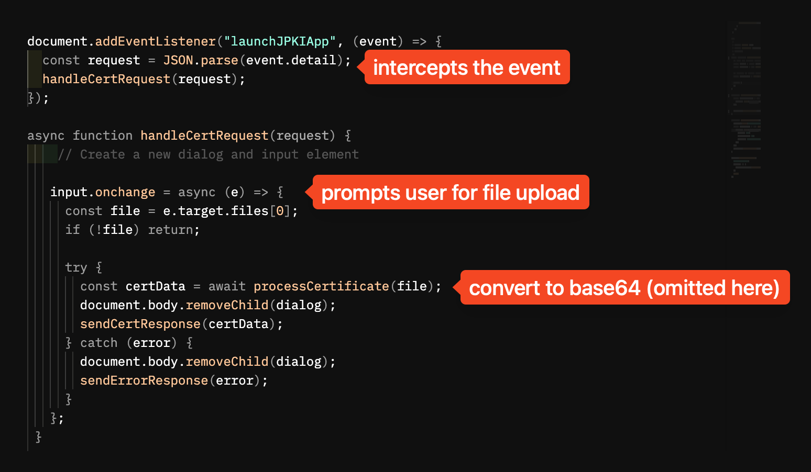

# JPKI Modified

Yeah. I hate it too. Having to queue up at the Immigration Office to do stuff with your residence card is a pain. 

By the way, do you know that you can already do it online? Yeah, you can. But you need an IC Reader (who the hell has that?) a Chrome Extension and a specialized software installed on your PC. 

Out of pure pettiness, I made a chrome extension that facilitates your process. Here's how I did it.

## Write-up

I have looked into the source code and found that it talks to a chrome extension which talks to the JPKI利用者ソフト which talks to the IC Reader. Insane.

I then download the extension source code then intercepts the `chrome.runtime.sendMessage` by just creating a `CustomEvent` directly that dispatches the event. And for the what certificate to use, I just let user upload the `.cer` file directly, then convert it to `base64`.

If possible, I would like to make an NFC tag reader that can read the IC card from Android. But I

1. don't really know how complicated the web api for that is
2. people don't know how to install extensions on Android

## How to use

### Pre-requisites
- Chrome
- JPKI利用者ソフト for Mac/Windows
- JPKI利用者ソフト for Android/iOS (iOS not tested)
- Your phone must has an NFC reader
- My Number Card

[Download Here](https://www.jpki.go.jp/download)
Just follow your common sense and find the keyword "Windows" or "Mac" etc. and click the big button to download.

### Extension Installation

Download this entire repository and extract it somewhere. Then open Chrome and go to `chrome://extensions/` and enable developer mode. Click on "Load unpacked" and select the folder where you extracted the repository.

Then you should see the extension in your extension list. 

### Prepare your certificate

1. Open the JPKI利用者ソフト on your phone and select my certificate

2. We are going to export both, so either of them is fine. Make sure to come back and export the other one later.

3. Touch your NFC reader to the My Number Card 
(Don't pull the card away until you see the final screen. This is important. If you pull it away, the export will fail and you will have to do it again.)

4. Input your password. The 著名用電子証明書 is the long one, and the 利用者証明用電子証明書 is the 4 digit one.

(it's case sensitive, but your keyboard will change to uppercase automatically which is absolutely annoying)

5. Keep your card stuck to your phone until you see the final screen. Now export the file.

6. Choose `.cer` format, export the file and save it somewhere. I recommend to go back `../` until you can put it in `Downloads` so you can find it easily. Then move it to your computer somehow. 

Not sure how this works on iOS because I don't know if they have a file manager over there. But I guess you can just airdrop it to your Mac.

1. Now you should have 2 files. One is the `CertUserSign...` and the other one is `CertUserAuth...`.

### Extension Usage

[This is the top page of the application system](https://www.ras-immi.moj.go.jp/WC01/WCAAS010/ras?dispOutputEvent=)

If you are the first time using the system, register your account. 

It will prompt you to upload your certificate twice.

The first one is the one with `CertUserSign...` in the name. The second one is the one with `CertUserAuth...` in the name.

If it's your second time (e.g. you already set your password), choose login and you will be prompted to only upload the `CertUserAuth...` certificate. Then you will be prompted to enter your password.

You should see the screen above with your name. If you reach here, then congratulations. Figure things out by yourself from here.